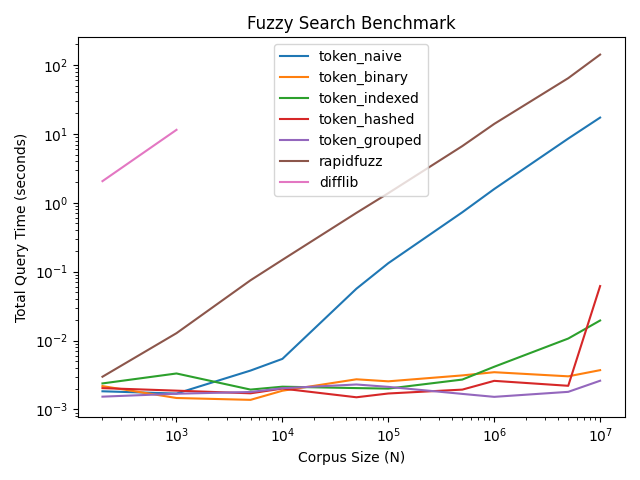

# token-fuzz-rs

[](https://pypi.org/project/token-fuzz-rs/)
[](https://pypi.org/project/token-fuzz-rs/)
[](https://github.com/matthewakram/token_fuzz_rs/blob/main/LICENSE)
[](https://github.com/matthewakram/token_fuzz_rs)

Fast token-based fuzzy string matching in Python for large, mostly static corpora.

- PyPI: https://pypi.org/project/token-fuzz-rs/
- Source: https://github.com/matthewakram/token_fuzz_rs

`token-fuzz-rs` is a Rust-powered, Python-first library that uses byte n-grams + MinHash signatures.
It is optimized for one-time indexing and very fast repeated queries.

If you need many fuzzy metrics, frequent data updates, or mostly one-off searches, use [RapidFuzz](https://github.com/maxbachmann/RapidFuzz).

---

## Install

```bash
pip install token-fuzz-rs
```

```python
from token_fuzz_rs import TokenFuzzer
```

---

## Quick Start

```python
from token_fuzz_rs import TokenFuzzer

data = [
    "hello world",
    "rust programming",
    "fuzzy token matcher",
]

fuzzer = TokenFuzzer(data)

print(fuzzer.match_closest("hello wurld"))
# "hello world"

results = fuzzer.match_closest_batch([
    "hello wurld",
    "rust progrmming",
])
print(results)
# ["hello world", "rust programming"]
```

---

## When to Use

Great fit when:
- Your corpus is large (thousands to millions of strings).
- The corpus is static or changes infrequently.
- You run many queries per index build.
- Token overlap matters more than strict character edit distance.

Less ideal when:
- Your corpus is small to medium.
- You need dynamic inserts/updates.
- You need many different scoring models.

---

## Configuration

```python
fuzzer = TokenFuzzer(
    data,
    num_hashes=256,
    method="binary",
    min_token_length=15,
    max_token_length=30,
)
```

Key knobs:
- `num_hashes`: higher values usually improve accuracy but cost more CPU and memory.
- `min_token_length` / `max_token_length`: byte n-gram window used for signatures.
- `method`: internal candidate-search strategy.

---

## Methods

All methods share the same public API.

### `"naive"` (default)
- Compares against all signatures.
- Stable and predictable.
- Strong baseline for small token windows.

### `"binary"`
- Uses a reverse index with binary-search-friendly lookups.
- Often best for longer token windows.
- Lower memory overhead than `hashed`.

### `"hashed"`
- Uses a hashed reverse index.
- Often fastest for long tokens and sparse matches.
- Higher memory usage than `binary` / `naive`.

### `"grouped"`
- Can be extremely fast when expected matches are very close.
- Works best when query and target signatures overlap heavily.
- Can be less precise when similarity is lower.

### `"indexed"` (legacy)
- Older strategy retained for compatibility.
- Prefer `binary` for new usage.

Rule of thumb:
- Small token windows (for example, `0..8`): start with `naive`; try `grouped` only if expected matches are very close.
- Large token windows (for example, `15..30`): start with `binary`; try `hashed` if you can afford more memory.

---

## API

```python
TokenFuzzer(
    data: list[str],
    num_hashes: int = 128,
    method: str = "naive",
    min_token_length: int = 0,
    max_token_length: int = 8,
) -> TokenFuzzer

match_closest(query: str) -> str
match_closest_batch(queries: list[str]) -> list[str]
```

Notes:
- Similarity is approximate (MinHash), not edit distance.
- The index is immutable; rebuild to add or remove items.

---

## Benchmark

Benchmark script: `bench/bench.py`

This benchmark runs 100 queries over corpora of increasing size and compares:
- `token-fuzz-rs` methods
- RapidFuzz (Levenshtein mode)
- Python `difflib`

The RapidFuzz run uses a high similarity cutoff (90%) to allow aggressive pruning and keep the comparison conservative.

```text
Benchmark Results:

       N  token_naive  token_binary  token_indexed  token_hashed  token_grouped  rapidfuzz   difflib
     200     0.001833      0.002181       0.002384      0.002038       0.001532   0.002982  2.059835
    1000     0.001699      0.001464       0.003324      0.001872       0.001689   0.012788 11.447527
    5000     0.003664      0.001376       0.001940      0.001713       0.001791   0.074934       NaN
   10000     0.005415      0.001867       0.002137      0.002006       0.002032   0.148314       NaN
   50000     0.056530      0.002737       0.002039      0.001500       0.002301   0.713207       NaN
  100000     0.132697      0.002557       0.002005      0.001703       0.002124   1.377787       NaN
  500000     0.728158      0.003116       0.002712      0.001938       0.001679   6.653677       NaN
 1000000     1.582175      0.003468       0.004162      0.002598       0.001522  13.954031       NaN
 5000000     8.548790      0.003022       0.010688      0.002202       0.001799  64.433099       NaN
10000000    17.240315      0.003714       0.019533      0.061761       0.002608 141.571023       NaN
```

At the largest corpus size in this run, the `hashed` method becomes memory-heavy and can slow down due to swapping.



---

## How It Works (High Level)

1. Strings are split into byte n-grams.
2. Tokens are converted to MinHash signatures.
3. Query signature similarity is estimated by signature overlap.
4. Best candidate is returned.

---

## Alternatives

- [RapidFuzz](https://github.com/maxbachmann/RapidFuzz): best general-purpose fuzzy matching toolkit for Python.
- [TheFuzz](https://github.com/seatgeek/thefuzz): simple API, useful for compatibility and quick prototypes.
- [textdistance](https://github.com/life4/textdistance): broad set of metrics for experimentation.
- [python-Levenshtein](https://github.com/ztane/python-Levenshtein): fast low-level edit-distance primitives.

---

## License

MIT. Contributions and issues are welcome.
